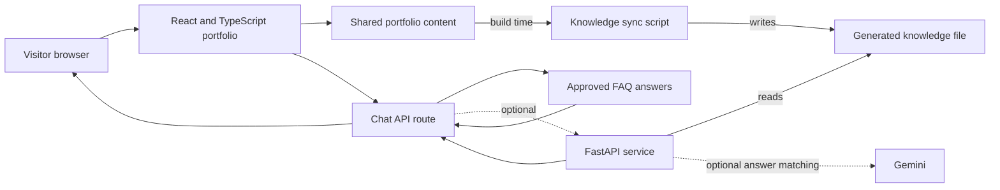

# Portfolio Template

A production-grade personal portfolio you can fork and make your own: a statically
rendered résumé site, a scroll-driven photo turntable behind an **Experience mode**
reveal, a chatbot that answers only from your own approved content, and a
first-party analytics stack with an admin dashboard, all deployed to a single
Cloudflare Worker.

This is a **sanitised template**. Every name, employer, client, credential,
recommendation, photograph and phone number in it is invented placeholder data
for a fictional person called **Alex Rivera**. Nothing here belongs to a real
individual or company. Replace it before you publish.

## What to replace first

| Replace | Where |
| --- | --- |
| Your name, contact details, social links | `content/portfolio.ts` (`profile`) |
| Employers, projects, clients, skills | `content/portfolio.ts` |
| Recommendations, awards, certifications | `content/portfolio.ts` (sample entries, clearly marked) |
| Chatbot answers and guard patterns | `content/faq.ts` (most answers derive from `portfolio.ts`) |
| Chatbot test expectations | `tests/chat-cases.json` |
| Portrait, avatar, résumé PDF | `public/portrait-*.jpg`, `public/avatar.jpg`, `public/resume-sample.pdf` |
| Turntable frames | `public/turntable/f-00..59.avif`, regenerated by `scripts/turntable-frames.swift` |
| Worker name and D1 database id | `wrangler.jsonc` |
| The operational dashboards showcase | `content/dashboards.ts`, `content/dashboards-demo.ts` |

The turntable frames that ship here are generated placeholders, not photographs.
`scripts/turntable-frames.swift` is the macOS tool that cuts and registers real
frames from a source sheet; its header carries the exact invocation.

Run `npm run typecheck && npm test` after editing content. The chatbot has two
implementations of the same logic (TypeScript and Python) kept in step by
`tests/chat-cases.json`, so a content change that breaks one breaks the suite.

Read `CLAUDE.md` for the architecture and `ANALYTICS.md` before touching
`lib/analytics/`.

## What is included

- A React and TypeScript website that works on desktop and mobile
- A résumé view and a scroll-driven turntable reveal
- Responsive animations with reduced-motion support
- A factual chatbot that works without an API key or paid subscription
- An optional FastAPI service that can use Gemini to match questions to approved portfolio answers
- One shared content source for the site and chatbot knowledge
- A private analytics dashboard at `/admin`, written from scratch, no Google Analytics, no Tag
  Manager, no third-party tracking script of any kind
- A `/privacy` page that states what is measured, for how long, and lets a visitor switch it off

## Run the website in under five minutes

You need **Node.js 22.13 or newer** and npm. Install Node.js from [nodejs.org](https://nodejs.org/) if `node --version` does not work in Terminal.

1. Get the project folder.

   If you received the project from GitHub, copy its HTTPS URL from the repository page and run:

   ```sh
   git clone <repository-url>
   cd portfolio
   ```

   If you received a ZIP file, extract it and open Terminal inside the extracted `portfolio` folder instead.

2. Install the JavaScript packages.

   ```sh
   npm install
   ```

3. Start the development server.

   ```sh
   npm run dev
   ```

4. Open the Local URL printed in Terminal, usually `http://localhost:3000`.

That is enough to use the full website and its factual chat guide. After the folder is on your computer, the website needs no chatbot key or paid AI subscription for the default experience.

## How to use the site

1. Read the résumé view first.
2. Press **Experience mode**, or wait ten seconds without interacting, to reveal the interactive view.
3. Move through the 3D system with the buttons, scrolling, and supported mouse or touch actions.
4. Open the chat button to ask about Alex's projects, skills, certifications, course notes, and experience.

The 3D view adapts to the device. Visitors can choose a lighter view or a 2D fallback, and the portfolio respects reduced-motion preferences.

## Technical architecture



The browser renders the React portfolio. The page content lives in TypeScript files so the website and chatbot use the same facts. At build time, the knowledge script creates the Python knowledge file from that shared content.

The chat route returns an immediate approved answer by default. It keeps the portfolio useful even if an optional Python service or AI provider is unavailable. If FastAPI and Gemini are configured, Gemini only selects from existing approved answers. It does not write new claims about Alex or expose private work.

## Technology choices

| Part | Tools | Why it is here |
| --- | --- | --- |
| Frontend | React, TypeScript, Vinext, Vite | Renders the portfolio and its routes |
| Styling | Tailwind CSS and custom CSS | Provides responsive layouts, transitions, and accessibility support |
| Interactive view | Three.js and React Three Fiber | Renders the 3D system experience only when needed |
| Chat | API route and approved FAQ content | Gives fast, source-backed answers with no external model required |
| Optional AI matching | Python, FastAPI, Gemini | Matches questions to approved answers without generating new portfolio claims |
| Hosting | Sites and Cloudflare Worker build | Packages the frontend and API route for the configured site |

## Project folders

| Folder or file | Purpose |
| --- | --- |
| `app/` | The page and chat API route |
| `components/portfolio/` | The résumé view, chat UI, 3D experience, and interactions |
| `content/portfolio.ts` | Profile, projects, experience, certifications, recommendations, and learning links |
| `content/faq.ts` | Chatbot answers and safety rules |
| `scripts/sync-knowledge.mjs` | Copies approved content into Python's knowledge file |
| `backend/` | Optional FastAPI chatbot service |
| `public/` | Public images and résumé files |
| `tests/` | Chatbot and FastAPI checks |
| `.openai/hosting.json` | Existing Sites hosting connection |

## Update portfolio content

Most edits belong in `content/portfolio.ts`.

1. Open `content/portfolio.ts` in an editor.
2. Update the relevant project, experience, certificate, recommendation, or course-note entry.
3. If the chatbot should answer a new topic, add a clear answer and matching words in `content/faq.ts`.
4. If you are testing FastAPI before a full build, run `node scripts/sync-knowledge.mjs` to refresh `backend/knowledge.json`.
5. Run the checks below.
6. Run `npm run build` before publishing. It also refreshes `backend/knowledge.json` from the shared content.

Only publish information that is safe for a public portfolio. Do not add credentials, client data, private repositories, internal links, source code, security findings, test data, or configuration secrets.

## Chatbot setup

### Default chatbot

The default chatbot has no external dependency. It answers from the approved facts in `content/faq.ts` and does not need configuration.

### NVIDIA NIM matching (no extra service)

The Worker can write a reply grounded in the documented answers, with no
Python service to host. It needs one secret, and the key is free.

#### Getting a key from NVIDIA, step by step

1. Go to **https://build.nvidia.com** and click **Login** (top right). Sign
   up with any email, or use Google/GitHub. A personal account is enough;
   you do not need an NVIDIA Enterprise or NGC subscription.
2. Verify your email if prompted, then sign back in.
3. Open any model page, for example
   **https://build.nvidia.com/openai/gpt-oss-20b**. That is the model this
   project uses by default.
4. On the right of the model page click **Get API Key** (some layouts show
   **Build with this NIM** first, then **Get API Key**).
5. Click **Generate Key**. A key appears beginning `nvapi-`.
6. **Copy it now.** NVIDIA shows the full key exactly once. If you lose it,
   generate another and delete the old one.

New accounts get a free allowance of credits, which is far more than a
personal portfolio uses: this site's own traffic is a few dozen questions a
month, and only the ones no documented answer matches reach the model at
all. There is no card required to start, and nothing here will bill you
without you adding one.

Keys are visible at **https://build.nvidia.com** under your account menu →
**API Keys**, where you can also revoke one.

#### Putting the key where the app reads it

Locally, add it to `.env.local` in the project root (this file is
gitignored and must never be committed):

```env
NIM_API_KEY=nvapi-your-key-here
```

Then restart `npm run dev` — environment files are read at startup, so a
running server will not pick it up.

For the deployed Worker, set it as a secret rather than a variable, so it is
encrypted and never printed back:

```sh
wrangler secret put NIM_API_KEY --name portfolio-template
# paste the nvapi-... key when prompted, then press Enter
```

Confirm it took effect:

```sh
wrangler secret list --name portfolio-template     # NIM_API_KEY should be listed
npm run check:model                        # calls the model directly and reports
```

`npm run check:model` is the quickest way to tell whether the key works: it
sends a handful of real questions, prints how many the model answered and
how long each took, and says plainly if the key is missing. Without a key
everything still works — the chatbot answers from the documented set and
`npm run test:chat` passes either way, which is exactly why a broken key can
go unnoticed.

#### If you ever paste a key somewhere public

Treat it as compromised and rotate it: generate a new key on
build.nvidia.com, delete the old one there, update `.env.local`, and re-run
`wrangler secret put NIM_API_KEY --name portfolio-template`. A key in a chat log, a
screenshot or a commit is a key someone else has.

`NIM_MODEL` is optional and defaults to `openai/gpt-oss-20b`, which answers in
about a second. Confirm any replacement against your own key first: most
models on `integrate.api.nvidia.com` are either not enabled for a given
account (an instant 404) or cold start past the 6s timeout.

Two limits on what the model is allowed to do, both deliberate:

- **It only sees questions no pattern matched.** A documented match is already
  correct, and the patterns in `content/faq.ts` are tuned against the exact
  questions in `tests/chat-cases.json`; a model overruling one can only
  regress. Every guard runs before it, so a sensitive, abusive, personal or
  off-topic question never leaves the Worker.
- **It returns an answer id, never prose.** It is sent the approved answer ids
  and their patterns as data, and the text served to the visitor is looked up
  from `content/faq.ts` by the id it names. An id that is not in the set is
  treated as no answer, and the visitor gets the built-in reply.

Answers matched this way are labelled `AI · grounded in portfolio`.

### Optional FastAPI service

Use this only if you want to run the Python service locally or deploy it separately.

Use a current Python 3 installation. Python 3.10 or newer is recommended.

```sh
python3 -m venv .venv
source .venv/bin/activate
pip install -r backend/requirements.txt
uvicorn backend.main:app --reload --port 8000
```

On Windows PowerShell, activate the virtual environment with:

```powershell
.\.venv\Scripts\Activate.ps1
```

Open `http://127.0.0.1:8000/health` to confirm that the service is running. It returns factual answers even without a Gemini key.

To let the local website use FastAPI, create a local `.env` file from `.env.example` and set:

```env
PYTHON_CHAT_URL=http://127.0.0.1:8000/chat
```

Restart `npm run dev` after changing `.env`.

### Optional Gemini matching

Gemini is optional. Its role is limited to selecting a suitable approved answer. It must never receive or return secrets, client data, source code, private links, or undocumented information.

1. Use `backend/.env.example` as a list of supported settings.
2. Set `GEMINI_API_KEY` in the FastAPI service environment.
3. For a hosted Python service, set a strong `CHAT_BACKEND_TOKEN` and use the same value for the website runtime configuration.
4. Set `PYTHON_CHAT_URL` to the public HTTPS `/chat` address of the Python service.

FastAPI does not load a `.env` file by itself. Set Python service values in the hosting provider's secret settings or export them in your terminal before starting `uvicorn`. Keep all real keys out of `.env.example`, source code, commits, and screenshots.

## Useful commands

| Command | What it does |
| --- | --- |
| `npm run dev` | Starts the local development website |
| `npm run typecheck` | Checks TypeScript types |
| `npm run check:links` | Opens every link in `content/portfolio.ts` as a stranger would |
| `npm test` | Runs every JavaScript check (needs `npm run dev` in another terminal) |
| `npm run test:units` | Runs the pure-logic checks only. Needs no server |
| `npm run test:chat` | Runs chat checks while `npm run dev` is still running in another terminal |
| `npm run test:analytics` | Runs analytics checks. Needs `ADMIN_TOKEN` set |
| `npm run build` | Creates a production build and refreshes Python knowledge |
| `npm run start` | Serves the built Cloudflare Worker locally after `npm run build` |
| `.venv/bin/python -m unittest discover -s tests -p 'test_*.py' -v` | Runs the Python chatbot checks on macOS or Linux |

## Deploying to Cloudflare, step by step

The site runs as a Cloudflare Worker. Everything below happens in **Terminal**,
in this folder. Open it with:

```sh
cd /Users/Alex/Alex/portfolio
```

VS Code's built-in terminal works too (**Terminal → New Terminal**, it opens
in this folder already).

**Use `npx wrangler`, not `wrangler`.** Wrangler is installed inside this
project rather than system-wide, so the bare command will say "command not
found". `npx` runs the local copy.

### 0. Get a Cloudflare account

If you do not have one, sign up free at
[dash.cloudflare.com/sign-up](https://dash.cloudflare.com/sign-up). No card
needed. The free plan covers this site comfortably, 100,000 requests a day and
5 GB of database.

### 1. Log in

```sh
npx wrangler login
```

A browser tab opens asking to authorise Wrangler. Click **Allow**. Back in
Terminal you should see `Successfully logged in`. This is once per machine.

Check it worked, and note the Account ID it prints, you need it in step 8:

```sh
npx wrangler whoami
```

### 2. Create the database

```sh
npx wrangler d1 create portfolio-analytics
```

It prints a block ending with something like:

```
[[d1_databases]]
binding = "DB"
database_name = "portfolio-analytics"
database_id = "a1b2c3d4-5678-90ab-cdef-1234567890ab"
```

**Copy that `database_id` value.** Ignore the rest of the block, this repo
already declares the binding.

### 3. Paste the id into `wrangler.jsonc`

Open `wrangler.jsonc` and find:

```jsonc
"database_id": "00000000-0000-4000-8000-000000000000",
```

Replace the zeros with the id from step 2, keeping the quotes. Save.

That placeholder is why `npm run deploy` refuses to run until you do this: a
deploy pointing at a database that does not exist comes up serving the site
perfectly while silently discarding every analytics write.

### 4. Create the tables

```sh
npm run db:migrate
```

Answer `y` when it asks to confirm against the remote database. It applies
`migrations/0001_init_analytics.sql`.

### 5. First deploy

```sh
npm run deploy
```

It typechecks, runs a preflight, builds, and uploads. It finishes by printing
your live URL, something like
`https://portfolio-template.<your-subdomain>.workers.dev`. Open it; the site
should load.

Analytics will not record anything yet. That is expected, the next step fixes
it.

### 6. Set the two secrets

Generate them (do not reuse the ones in `.env.local`: local and production
should differ, so a leak of one does not expose the other):

```sh
npx wrangler secret put ANALYTICS_IP_SALT
# paste the output of: openssl rand -hex 32
npx wrangler secret put ADMIN_TOKEN
# paste the output of: openssl rand -hex 32
```

Each command waits for you to paste a value and press Enter. Nothing is echoed
to the screen, and the value is stored encrypted on Cloudflare. Never on disk
and never in this repo.

Run `openssl rand -hex 32` in a second Terminal tab to generate each value.

**Do not set `TRUST_PLATFORM_AUTH_HEADER`.** It tells the admin gate to trust a
request header, which is only safe behind an ingress that strips inbound copies.
Cloudflare does not. `npm run deploy` blocks if it finds it set.

### 7. Deploy again, then check

```sh
npm run deploy
```

Confirm the database binding and secrets resolved, replace `<url>` with your
live URL and `<token>` with the ADMIN_TOKEN from step 6:

```sh
curl -X POST <url>/api/admin/analytics \
  -H "Authorization: Bearer <token>" \
  -H 'Content-Type: application/json' \
  -d '{"action":"whoami"}'
```

You want `"resolved": true` and `"hasIpSalt": true`. Then open `<url>/admin`,
paste the token, and the dashboard should load.

### 8. Deploy automatically on push (optional)

Add two repository secrets under **Settings → Secrets and variables → Actions**:

- `CLOUDFLARE_API_TOKEN`: create at
  [dash.cloudflare.com/profile/api-tokens](https://dash.cloudflare.com/profile/api-tokens)
  using the **Edit Cloudflare Workers** template
- `CLOUDFLARE_ACCOUNT_ID`: the value from `npx wrangler whoami` in step 1

After that, `.github/workflows/deploy.yml` deploys every push to `main`.

### 9. A custom domain (optional)

Buy a domain, add it to Cloudflare as a site (free plan), point your
registrar's nameservers at Cloudflare, then in the dashboard go to
**Workers & Pages → portfolio-template → Settings → Domains & Routes → Add custom
domain**.

Then tell me the domain and I will update `metadataBase` in `app/layout.tsx`
and `SITE_URL` in the retention workflow, both of which still name the old
host.

### 10. Changing the site URL

The workers.dev address is `<worker-name>.<account-subdomain>.workers.dev`.
The first label is `"name"` in `wrangler.jsonc`; the second is an **account**
setting (**Workers & Pages → Subdomain → Change**) and is where most of the
length usually is.

Three things break the moment the address changes, and all three are avoidable
if you do this in order:

1. **Add the new origin to Google sign-in first.** Google Cloud Console →
   **APIs & Services → Credentials → your OAuth 2.0 Client ID → Authorized
   JavaScript origins**. A client can list several origins, so add the new one
   *before* the switch and remove the old one after: sign-in on `/admin` never
   goes down. Miss this and the button silently fails on the deployed Worker
   with the only symptom in the browser console. The token form below the
   button is the break-glass if you are locked out.

2. **Check what else is on the account.** Changing the subdomain changes the
   workers.dev URL of *every* Worker in the account, not just this one. Open
   **Workers & Pages** and look at the list before you rename.

3. **Re-export the résumé PDF.** `public/resume-sample.pdf` prints the
   site URL as **plain text, not a link**, a `*.workers.dev` link annotation
   was one of the two things making Gmail quarantine the download as a virus
   (the other was the headless-Chrome export fingerprint). So the URL cannot be
   byte-patched in place any more, and a changed host needs a genuine re-export
   from the HTML source, which is not in this repo.

   ```sh
   node scripts/resume-url.mjs                     # show the links it carries
   node scripts/resume-url.mjs https://new-url/    # rewrite LinkedIn/GitHub/X, in place
   ```

   Then re-upload it wherever it is linked from (LinkedIn, job applications).
   Copies already in someone's inbox keep the dead URL. There is no fixing
   those, which is the argument for step 9's custom domain.

   When you re-export, keep the portfolio entry unlinked and set the document's
   own `/Creator` and `/Producer`. `npm run preflight` blocks a deploy that
   reintroduces either, because both come back for free on the next export and
   the failure shows up in a recruiter's inbox rather than here.

Then update the two places in the repo that name the host, `metadataBase` in
`app/layout.tsx` and the `SITE_URL` fallback in
`.github/workflows/retention.yml` (better: set `SITE_URL` as a repository
variable, which the workflow already prefers), and `npm run deploy`.

Renaming the *Worker* rather than the subdomain is a different operation: it
creates a new Worker, so the D1 binding follows the config but `ADMIN_TOKEN`,
`ANALYTICS_IP_SALT`, `ADMIN_EMAILS` and `GOOGLE_CLIENT_ID` all have to be set
again with `wrangler secret put`, and the old Worker deleted.

### Local secrets for `npm run start`

`npm run dev` reads `.env.local`. **`npm run start` does not**. That runs
Wrangler, which reads a different file. If you want the built Worker to have a
salt and token locally, create `.dev.vars`:

```env
ANALYTICS_IP_SALT=any-random-string
ADMIN_TOKEN=a-token-of-at-least-32-characters
```

It is gitignored. Without it, `npm run start` serves the public pages fine but
refuses analytics writes and has no way into `/admin`.

### Notes

`npm run deploy` runs a preflight that refuses to publish a configuration which
would come up half-working, a placeholder database id, a missing salt or
token, or the header-trust flag left on. Each of those otherwise deploys
successfully and then fails quietly, which is harder to notice than a failure.

`.openai/hosting.json` keeps the older OpenAI Sites deployment working while
that file exists. Delete it to drop that target. If you keep it, set
`TRUST_PLATFORM_AUTH_HEADER=1` **there only**, or `/admin` on that host falls
back to token-only.

`npm run lint` reports pre-existing problems in the generated `components/ui/` files, so it is not a
pass or fail gate. Lint the folders you changed instead.

## Analytics

The site measures its own usage and shows it at `/admin`. It records which sections people read,
where they click, how far they scroll, and what they ask the chatbot, and it stores no visitor IP
address, only a salted hash and a coarse network prefix.

There is also a **public showcase at `/analytics`**, the same dashboard, running on synthetic
sample data so it can be shared without exposing anyone's visit. The private panel shows the text
people typed into the chat and a per-visit table with city and network operator, which is not
something to publish. Regenerate the sample with `npm run seed:demo`.

To run it locally, create `.env.local` with:

```env
ANALYTICS_IP_SALT=any-random-string
ADMIN_TOKEN=a-token-of-at-least-32-characters
ADMIN_EMAILS=your@email.address
```

Then open `http://localhost:3000/admin`. Storage is a Cloudflare D1 database named by `"d1"` in
`.openai/hosting.json`; set that to `null` and the whole system turns itself off cleanly rather than
erroring.

`ANALYTICS.md` is the full account: what is recorded, how long it is kept, and the reasoning behind
the parts that look odd. Read it before changing anything under `lib/analytics/`.

## Hosting

This repository contains `.openai/hosting.json`, which connects it to the existing Sites project. The configured Sites build uses the React portfolio and factual chat fallback.

The optional FastAPI service is separate from the Sites JavaScript Worker. If you enable it, deploy FastAPI to a Python compatible service you control, configure its environment variables there, and then point `PYTHON_CHAT_URL` at its HTTPS `/chat` endpoint.

## Before you publish

1. Check every new public link in a private browser window.
2. Run `npm run typecheck`, `npm run test:chat`, and `npm run build`.
3. Verify that photos, résumé files, and course notes are intended for public sharing.
4. Search for secrets before committing. Do not commit `.env` files or personal access tokens.
5. Confirm that every client description is a safe high-level summary.

## Design reference

The interactive direction was inspired by [Amazing Portfolio Web Design Inspiration of 2026](https://www.youtube.com/watch?v=uw6C8Z1XieY). The résumé-to-3D reveal and content structure are original to this project.
